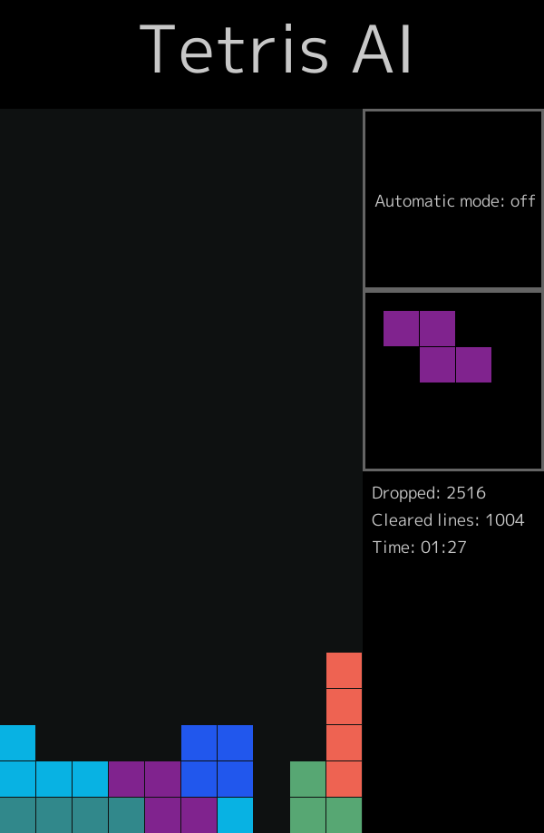
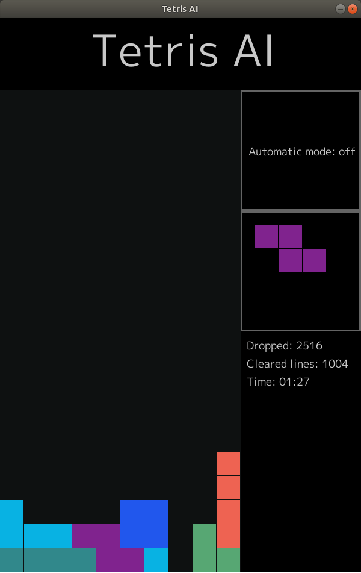
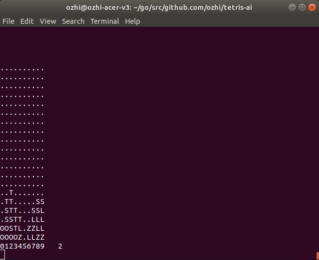

# tetris-ai
An algorithm that plays [Tetris](https://en.wikipedia.org/wiki/Tetris) better that you, visualized.

Watch as the AI drops **a few dozen** tetrominoes per second!
* Based on [Minimax](https://en.wikipedia.org/wiki/Minimax)
* Supports Android, GUI and CLI.

Supports easy extending with
* different user interfaces
* different AI algorithms

## Installation

<table>
  <thead>
    <tr>
      <td>OS X</td>
      <td>Linux</td>
    </tr>
  </thead>
  <tbody>
    <tr>
      <td>
        <pre lang="sh">go get github.com/ozhi/tetris-ai</pre>
      </td>
      <td>
        <pre lang="ah">
sudo apt install \
  libglu1-mesa-dev \
  libgles2-mesa-dev \
  libxrandr-dev \
  libxcursor-dev \
  libxinerama-dev \
  libxi-dev \
  libasound2-dev

go get github.com/ozhi/tetris-ai</pre>
      </td>
    </tr>
  </tbody>
</table>

## Running

| Android  |                    GUI                      |                     CLI                   |
|:--------:|:-------------------------------------------:|:-----------------------------------------:|
| `gomobile build` | `go run main.go` | `go run main.go -cli` |
|  |    |  |
| Press the buttons | Press the buttons or `<space>` - drop next, `A` - automatic mode | Automatic mode only |

## Documentation

Code documentation on [godoc.org/github.com/ozhi/tetris-ai](https://godoc.org/github.com/ozhi/tetris-ai).

Tetris-AI has four packages:

* `tetris`
  contains structs and behaviour of the basic components of the tetris game - the board and tetromino.

* `ai`
  contains the artificial intelligence that plays tetris.

  For each move, it searches the state space of the game - all possible board states that can be
  reached after dropping the current and next tetromino. Each of those states is evaluated and
  the "best" is chosen.

  The AI evaluates boards using the [minimax](https://en.wikipedia.org/wiki/Minimax) algorithm -
  how "good" will the state be even if the next tetromino happens to be very "bad".

  How "good" a board is is determined with a utility function that takes in to account:
  * the number of lines cleared in the game (more is better)
  * the aggregated height of the columns (less is better)
  * the 'bumpiness' of the board (difference in column heights) (less is better)
  * the number of 'holes' in the board (less is better)

  Each of these is taken with a different coefficient, chosen with trial and error.

  In order for the AI to play fast enough (tens of tetrominoes every second),
  the [alpha-beta pruning](https://en.wikipedia.org/wiki/Alpha%E2%80%93beta_pruning) optimization
  is used to reduce the size of the state tree to be searched.

* `gui`
  contains the graphical user interface of the app.

  It uses the [ebiten](https://hajimehoshi.github.io/ebiten/) library for visualizations.

* `cli`
  contains the command-line interface of the app.

  It is simple and boring.

## License

Tetris-ai is licensed under MIT license. See [LICENSE](./LICENSE).
